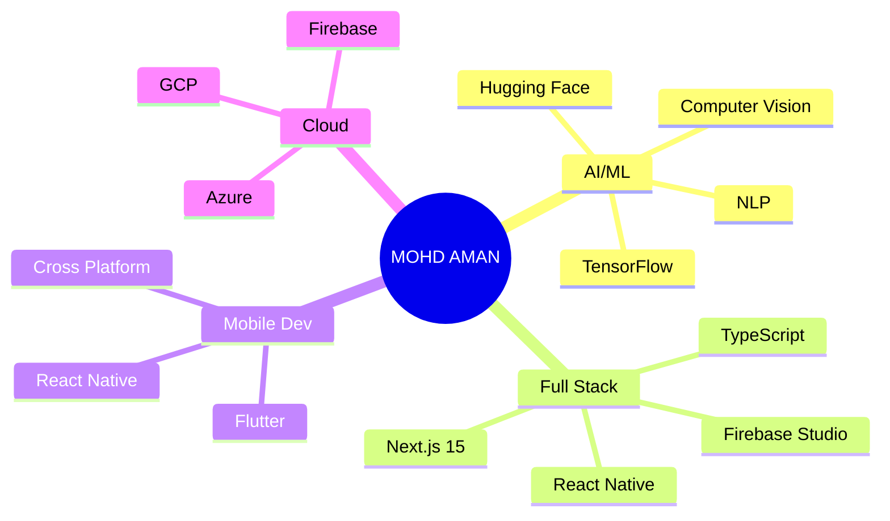

# 💫 MOHD AMAN

<div align="center">
  
  

  

</div>

---

## 🌌 ABOUT ME

```typescript
const aman = {
  role: "Full-Stack Developer & AI Engineer",
  location: "India 🇮🇳",
  education: "Computer Science",
  currentFocus: ["AI Integration", "Next.js 15", "TensorFlow", "React Native"],
  askMeAbout: ["Web Dev", "AI/ML", "Mobile Apps", "Firebase", "Computer Vision"],
  funFact: "I turn coffee into code and ideas into AI-powered solutions ☕→💻"
};
```

<div align="center">

### 🎯 *"Code is poetry written in logic"*

</div>

---

## 🚀 TECH ARSENAL

<div align="center">

### 💻 **Frontend Development**


### 📱 **Mobile Development**


### ⚙️ **Backend Development**


### 🤖 **AI/ML & Data Science**


### 🗄️ **Database & Cloud**


### ☁️ **Cloud & Hosting**


### 🛠️ **Tools & Platforms**


</div>

---

## 🎨 FEATURED PROJECTS

<div align="center">

### 🌟 **Aicademy – AI Learning Platform**
[](https://github.com/MohammadAmannn)

```
AI-generated courses, video recommendations, intelligent notes & doubt support
```

**Tech Stack:**
`Next.js` • `Drizzle ORM` • `Google Gemini` • `Tailwind CSS` • `Shadcn UI` • `TypeScript`

---

### 🌱 **GrowTo – Agriculture Landing Website**
[](https://github.com/MohammadAmannn)

```
Beautiful animated website built for a real agriculture company
```

**Tech Stack:**
`Next.js 15` • `Tailwind CSS` • `Framer Motion` • `TypeScript` • `Responsive Design`

---

### 🏠 **Smart Home AI System**
[](https://github.com/MohammadAmannn)

```
Intelligent home automation with computer vision & voice control
```

**Tech Stack:**
`TensorFlow` • `OpenCV` • `Python` • `React Native` • `Firebase` • `IoT Integration`

</div>

---

## 📊 GITHUB ANALYTICS

<div align="center">
  
  
  
  
  
  

  
  
</div>

---

## 🏆 GITHUB TROPHIES

<div align="center">
  
  

</div>

---

## 📈 CONTRIBUTION GRAPH

<div align="center">

[](https://github.com/MohammadAmannn)

</div>

---

## 🌐 CONNECT WITH ME

<div align="center">

[](https://github.com/MohammadAmannn)
[](https://www.linkedin.com/in/mohd-aman-021261236/)
[](https://www.instagram.com/oyie.aman?igsh=MXNqOXB5MXNiODdjZA==)
[](https://x.com/wtf__ammu?t=8JbFEAR9JrjICZfkLT7ZFw&s=09)
[](mailto:itsaman00786@gmail.com)

### 📧 Email: **itsaman00786@gmail.com**

</div>

---

## 💡 CURRENT FOCUS

<div align="center">



</div>

---

## 🎯 2025 GOALS

- 🚀 Build 10+ AI-powered applications
- 📱 Master React Native & Flutter for cross-platform development
- 🤖 Contribute to open-source AI/ML projects
- 📚 Launch an AI course platform
- 🌍 Collaborate with developers worldwide
- 🏆 Reach 1000+ GitHub stars

---

## 📝 LATEST BLOG POSTS

<!-- BLOG-POST-LIST:START -->
- 🤖 Building AI-Powered Web Apps with Next.js and Gemini
- 📱 React Native vs Flutter: A Complete Comparison
- 🎨 Mastering Animations with Framer Motion
- 🔥 Firebase Studio: The Complete Guide
- 🧠 Computer Vision with OpenCV and TensorFlow
<!-- BLOG-POST-LIST:END -->

---

## 💰 SUPPORT MY WORK

<div align="center">

If you like my work, consider giving a ⭐ to my repositories!

[](https://buymeacoffee.com)
[](https://paypal.me)

</div>

---

## 📊 CODING STATS

<div align="center">

<!--START_SECTION:waka-->
```text
TypeScript   12 hrs 30 mins  ████████████░░░░░░░░░   48.2%
JavaScript   6 hrs 15 mins   ██████░░░░░░░░░░░░░░░   24.1%
Python       4 hrs 20 mins   ████░░░░░░░░░░░░░░░░░   16.7%
CSS          2 hrs 10 mins   ██░░░░░░░░░░░░░░░░░░░    8.4%
Other        0 hrs 40 mins   █░░░░░░░░░░░░░░░░░░░░    2.6%
```
<!--END_SECTION:waka-->

</div>

---

## 🐍 CONTRIBUTION SNAKE

<div align="center">
  
  

</div>

---

<div align="center">

### 💭 *"First, solve the problem. Then, write the code."* – John Johnson

### 🚀 Let's Build Something Amazing Together!

[](https://github.com/piyushsuthar/github-readme-quotes)

---


**⭐ From [MohammadAmannn](https://github.com/MohammadAmannn) with 💜**

</div>
